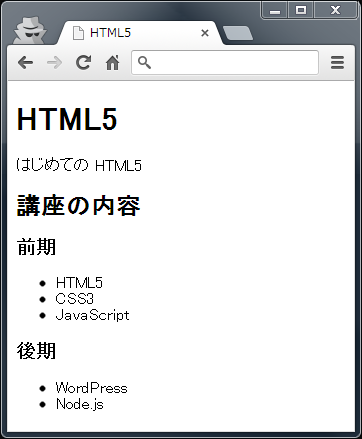

HTML 基礎 01 課題
================

目的
----
HTML5 の正しい書き方を身に付ける。

内容
----
`index.html` を下記の画像と同様に表示されるように修正する。  

条件
----
* ファイルは、用意された `index.html` のみを用いること
* CSS や JavaScript は用いないこと
* ブラウザには [Google Chrome](http://www.google.co.jp/intl/ja/chrome/browser/) を用いること
* HTML タグは何を使っても良い

提出先
-----
Google Drive の所定の共有フォルダ (自分の学籍番号のフォルダ)